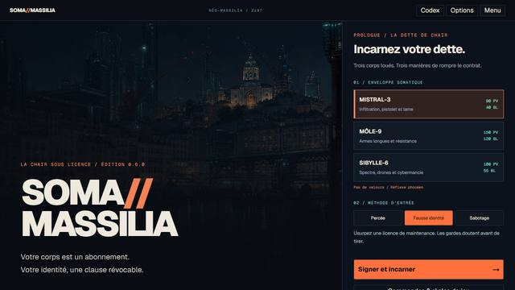
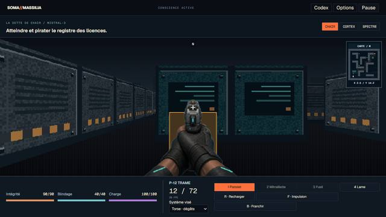
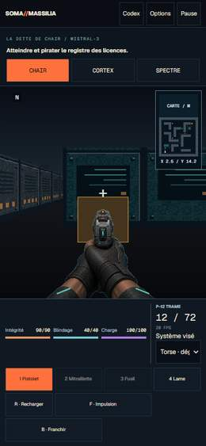
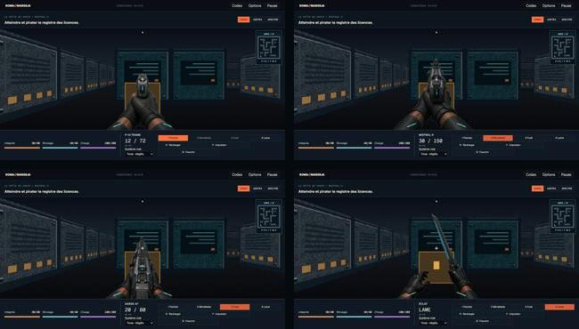

# Captures QA 0.6.0

Captures du build de production local du 1er septembre 2026, session Chromium
`soma060prod` pilotée avec `agent-browser 0.36.0`.

- `menu-desktop.jpg` : menu 1280×720, version 0.6.0.
- `chair-desktop.jpg` : prologue signé puis mode Chair, P-12 TRAME.
- `chair-mobile.jpg` : même sauvegarde au viewport 390×844.
- `viewmodels-live.jpg` : pistolet, mitraillette, fusil et lame réellement
  sélectionnés dans le canvas. Une fixture QA isolée a uniquement déverrouillé
  SMG et fusil ; elle ne simule pas une progression gagnée.

Les JPEG sont des copies optimisées des captures PNG de travail. Ils servent de
preuves visuelles et non d’assets de gameplay. Les contrôles automatisés,
mesures responsive, PWA, accessibilité et limites sont détaillés dans
[VALIDATION.md](../../../VALIDATION.md).

